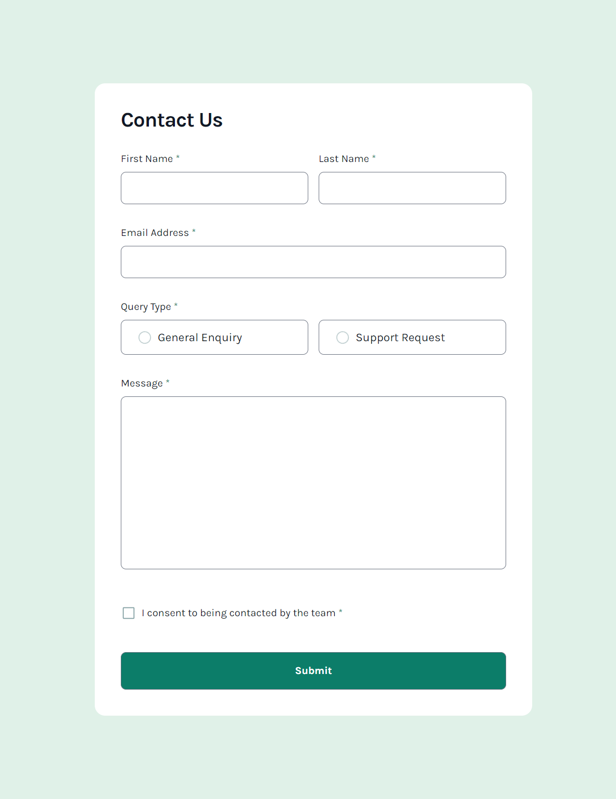

# Frontend Mentor - Contact form challenge

This is a solution to the [Contact challenge challenge](https://www.frontendmentor.io/challenges/contact-form--G-hYlqKJj).

## Table of contents

- [Overview](#overview)
  - [The challenge](#the-challenge)
  - [Screenshot](#screenshot)
  - [Links](#links)
- [My process](#my-process)
  - [Built with](#built-with)
  - [What I learned](#what-i-learned)
- [Author](#author)

## Overview

### The challenge

Your challenge is to build out this contact form and make it look as close to the design as possible. Pay particular attention to making this form accessible.

Your users should be able to:

- Complete the form and see a success toast message upon successful submission
- Receive form validation messages if:
- A required field has been missed
- The email address is not formatted correctly
- Complete the form only using their keyboard
- Have inputs, error messages, and the success message announced on their screen reader
- View the optimal layout for the interface depending on their device's screen size
- See hover and focus states for all interactive elements on the page

### Screenshot

### Links

- Live Site URL: [on netlify](https://prismatic-boba-aefbff.netlify.app/)

## My process

First I implemented skeleton of mobile design, after that I played with functionality quite a bit. I wanted to keep as many form components uncontrolled as possible, because I wanted to explore limits of built-in html validation and form handling.  

### Built with

- Mobile-first workflow
- [TS](https://www.typescriptlang.org/) - Typescript
- [React](https://reactjs.org/) - JS library
- [Tailwindcss](https://tailwindcss.com/) - For styles

### What I learned

- Keeping form elements uncontrolled was not fun. It seems to go against unidirectional data flow of react, and is quite inflexible to work with. For instance styling :invalid state was quite tricky because form elements start at the point when they're invalid when empty and we require some value. This made me use custom isValid state which kind of broke single source of truth for validity of form elements.

- I streched my tailwindcss muscle quite a bit, learned how to apply linear gradients, played with grid classes and so much more.

## Author

- Frontend Mentor - [@raswonders](https://www.frontendmentor.io/profile/raswonders)
- Twitter - [@raswonders](https://www.twitter.com/raswonders)
- LinkedIn - [Rastislav Hepner](https://www.linkedin.com/in/rastislavhepner/)
